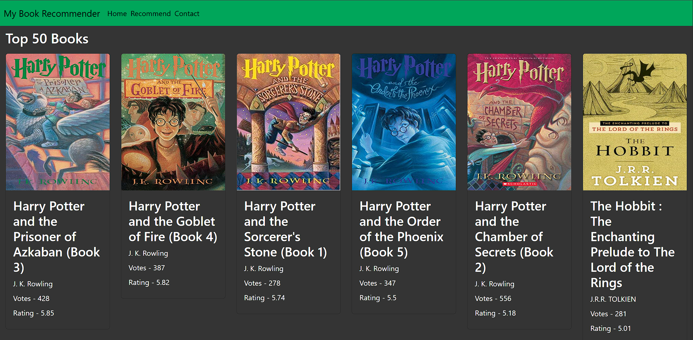

# Book Recommender System



This project demonstrates building a **book recommendation system** with a focus on machine learning. The system uses collaborative filtering to recommend books based on user ratings and book similarities. A **Python Flask server** serves the recommendation model, and a **frontend website** built with HTML, CSS, and JavaScript allows users to explore popular books and get personalized recommendations.

The machine learning workflow involves loading and preprocessing datasets, creating a pivot table of user ratings, computing similarity scores between books, and saving the trained model for fast prediction. Users can select a book, and the system displays the top 5 most similar books based on the precomputed model.

## Technologies and Tools Used

- **Python**
- **NumPy** and **Pandas** for data preprocessing
- **Scikit-learn** for similarity computation and model building
- **Jupyter Notebook** for experimentation and data exploration
- **Python Flask** for serving predictions via HTTP
- **HTML, CSS, and JavaScript** for the frontend
- **Bootstrap 5** for responsive UI

## Features

- Browse top 50 popular books with author, rating, and votes
- Get top 5 recommended books based on a selected book using collaborative filtering
- Interactive and responsive frontend
- Handles invalid input gracefully with error messages

## Machine Learning Workflow

1. **Data Loading**: Load `Books.csv`, `Users.csv`, and `Ratings.csv`.
2. **Data Cleaning**: Remove duplicates, handle missing values, and filter active users/books.
3. **Pivot Table Creation**: Construct a user-item matrix of ratings (`pivot_table.pkl`).
4. **Similarity Computation**: Compute book-to-book similarity (`similarity_score.pkl`) using cosine similarity.
5. **Model Serialization**: Save the pivot table, similarity matrix, and book data as `.pkl` files for fast Flask serving.
6. **Recommendation**: Retrieve top 5 similar books for a given input book using the precomputed similarity matrix.

## Project Structure

```
/model
    book_recommender_system.ipynb
    Users.csv
    Ratings.csv
    Books.csv
/templates
    index.html
    recommend.html
app.py
books.pkl
similarity_score.pkl
pivot_table.pkl
popularity.pkl
requirements.txt
Procfile
```

## How to Run Locally

1. **Clone the repository**:
   ```bash
   git clone <repository-url>
   ```

2. **Navigate to the project folder**:
   ```bash
   cd <repository-folder>
   ```

3. **Install required Python packages**:
   ```bash
   pip install -r requirements.txt
   ```

4. **Start the Flask server**:
   ```bash
   python app.py
   ```
   The server runs on `http://localhost:5000` by default.

5. **Open the frontend**:
   - Access the Flask routes `/` and `/recommend` to browse books and get recommendations.

## Deployment on Render

1. Push your repository to GitHub (all files including `.pkl` and `templates` folder).
2. Create a new Web Service on Render.
3. Set the Environment to Python 3 and use `gunicorn app:app` as the start command.
4. Ensure `requirements.txt` includes all dependencies: `flask`, `numpy`, `pandas`, `gunicorn`.
5. Render will provide a live URL once deployed.

## Future Improvements

- Explore matrix factorization or content-based filtering for better recommendations
- Add user authentication for personalized suggestions
- Include interactive visualizations such as popular genres or trending books
- Optimize performance for large datasets

Live Demo - https://bookrecommendersystem-kxuc.onrender.com/
